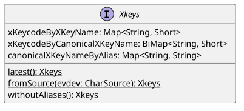
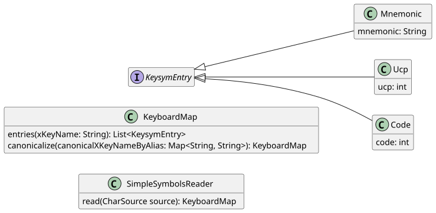
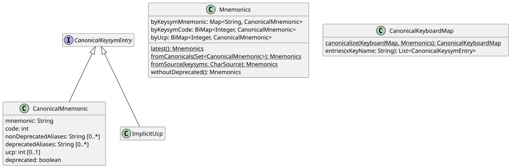
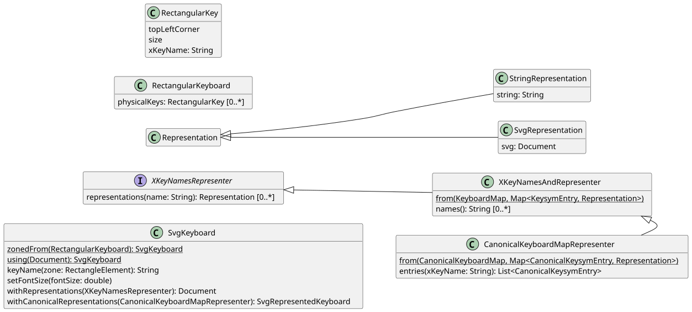

= Keyboardd

A keyboard drawer library. Can be used to parse and manipulate keyboard maps and display them as SVG, so as to represent a given keyboard layout or keyboard shortcuts.
Includes support for XKB governed systems, including Wayland, but may be useful (and runs) on other systems.

== Get started
As a toy example, let’s represent the infamous Stackoverflow three keys keyboard, https://stackoverflow.blog/2021/09/28/become-a-better-coder-with-this-one-weird-click/[The Key].

We start with https://github.com/oliviercailloux/Keyboardd/blob/main/src/test/resources/io/github/oliviercailloux/keyboardd/thekey/The%20Key.json[this] json file, which represents the physical keyboard. 

https://github.com/oliviercailloux/Keyboardd/blob/main/src/test/java/io/github/oliviercailloux/keyboardd/thekey/TheKeyEmptySvgTests.java[This code] produces the keyboard in figure <<Unlabeled>>.

.The Key as an unlabeled SVG keyboard
[[Unlabeled]]
image::https://github.com/oliviercailloux/Keyboardd/blob/main/src/test/resources/io/github/oliviercailloux/keyboardd/thekey/The%20Key.svg[opts=inline]

This is an https://github.com/oliviercailloux/SVG-keyboard/blob/main/README.adoc[SVG keyboard]: the file contains the X key names of the corresponding keys, as can be seen by looking at the SVG source code.

https://github.com/oliviercailloux/Keyboardd/blob/main/src/test/java/io/github/oliviercailloux/keyboardd/thekey/TheKeyXKeyNamesTests.java#L22-L36[This code] uses the above SVG unlabeled file to produce a labeled keyboard (figure <<Labeled>>). 

.The Key as a labeled SVG keyboard
[[Labeled]]
image::https://github.com/oliviercailloux/Keyboardd/blob/main/src/test/resources/io/github/oliviercailloux/keyboardd/thekey/The%20Key%20with%20X%20key%20names.svg[opts=inline]

Alternatively, https://github.com/oliviercailloux/Keyboardd/blob/main/src/test/java/io/github/oliviercailloux/keyboardd/thekey/TheKeyXKeyNamesTests.java#L39-L69[this code] produces a more appealing representation (figure <<Final>>).

.The Key, our final SVG keyboard
[[Final]]
image::https://github.com/oliviercailloux/Keyboardd/blob/main/src/test/resources/io/github/oliviercailloux/keyboardd/thekey/The%20Key%20with%20chosen%20representations.svg[opts=inline]

Here is https://github.com/oliviercailloux/mykbd/[a more realistic example] use of this library, that displays a “real” keyboard.

== More realistic example
https://github.com/oliviercailloux/mykbd/[This repository] shows how to generate an image for a real keyboard with a real layout (namely, the one I use).

== More details
To exploit the full potential of this library, you might need to understand at least roughly https://github.com/oliviercailloux/XKB-doc/blob/main/README.adoc[how keyboards work under XKB]. Sorry for this.
Referring to figure <<XM>> while reading further might help.

.X mappings
[[XM]]
image::https://github.com/oliviercailloux/XKB-doc/raw/main/X%20mappings.svg[Mappings and sources, opts=inline]

Here is a quick overview of the main concepts (by class name) that this library permits to manipulate.
The terms are defined https://github.com/oliviercailloux/XKB-doc/blob/main/README.adoc#Concepts[here]. 

`XKeys`: a set of standard X key names (canonical and aliases) and corresponding X keycodes; can be obtained from a standard (embedded) `evdev` file.

.XKeys
[[XKeys]]

* `Mnemonics`: a set of keysym mnemonics, together with information per mnemonic (the keysym code it maps to, whether it is an alias, whether it is deprecated, which UCP corresponds to it if any, …); can be obtained from a standard (embedded) `xkbcommon-keysyms.h` file; can be used to obtain a `UcpByCode`.
* `KeyboardMap`: x key names to keysym entries; typically defined in a set of local “symbol” configuration files; can be obtained using `SimpleSymbolsReader`.

.Mapping
[[Mapping]]

.Mnemonics
[[Mnemonics]]

* `RectangularKeyboard`: can be parsed from json using `JsonRectangularKeyboardReader`
* `Representation`: a String or an SVG icon
* `XKeyNamesRepresenter`: x key names to representations; may be obtained by combining a `KeyboardMap` and a mapping from keysym entry to representation (TODO)
* `SvgKeyboard`: read from and produce https://github.com/oliviercailloux/SVG-keyboard[svg keyboard files]; can be obtained from a `RectangularKeyboard` together with an `XKeyNamesRepresenter` (yields a rectangular keyboard with labels) or from another `SvgKeyboard` together with an `XKeyNamesRepresenter` (yields a more complex SVG keyboard).

* _UCP by keysym code_: maps keysym codes to their corresponding UCP (for those codes which have one), TODO remove?

.Representable
[[Representable]]

== Vocabulary
The code uses the following terms and abbreviations.

* `name` is an X key name (when not specifying whether it’s a canonical name or an alias)
* `canonical name` is an X key name that is not an alias
* `alias name` is an X key name that is an alias
* `code` as `short` is an X keycode
* `code` as `int` is a keysym code
* `mnemonic` is a keysym mnemonic (when not specifying whether it’s a canonical mnemonic or an alias)
* `canonical mnemonic` is a keysym mnemonic that is not an alias
* `alias mnemonic`

The argument names use the non-abbreviated names; the method and class names use the abbreviated names (unless an abbreviated name would raise some ambiguity). For example: `nameFromMnemonic(keysymMnemonic: String)`. The diagrams use the non-abbreviated names.

For example, an argument that represents a canonical X key name is (following the https://google.github.io/styleguide/javaguide.html#s5.3-camel-case[GJSG], despite https://github.com/checkstyle/checkstyle/issues/14239#issuecomment-1883019025[disagreement]) `canonicalXKeyName`.

== SVG keyboards
This library produces https://github.com/oliviercailloux/SVG-keyboard/blob/main/README.adoc[SVG keyboards] that target a given physical size so as to represent the keys and the keyboard with a scale of 1:1. To do this, the library assumes that the viewer (or printer) uses 96 DPI. SVG keyboards that this library produces therefore have a size in pixels, equivalently (given the DPI value), a size in cm.

Key bindings may be represented by embedded SVG documents. Such documents may themselves have a native size in pixels (thus, still assuming 96 DPI, a native size in cm). This is useful if the embedded SVG document contains letters in a font that should be represented exactly at 10px, for example. Which in turn is useful for uniformity accross keys. This also permits to use a drawing that represents the key cap and whose size represents the physical size of the keyboard key cap.
Thus, if the given SVG documents (to be embedded) have a size, the library will respect this size and center the document in the key binding zone. If the document is too large, it will be resized to fit the zone.

Headers follow the https://svgwg.org/svg2-draft/struct.html#NewDocument[SVG2 spec].

== Limitations
This library represents in the same way a key mapping using UCP written as U+xxxx, using the corresponding character, or using the corresponding mnemonic. But internally, X may use different codes. Consider for example the mnemonic “exclam” with keysym code 0x21 and the keysym code 0x1000021, with no mnemonic, corresponding to U+0021 EXCLAMATION MARK. This happens for most mnemonics defined from lines 0 to 1800, then not for most mnemonics defined from lines 1800 to 3200.
It https://github.com/xkbcommon/libxkbcommon/issues/433[might be] that keyboard shortcuts differ, for example.
